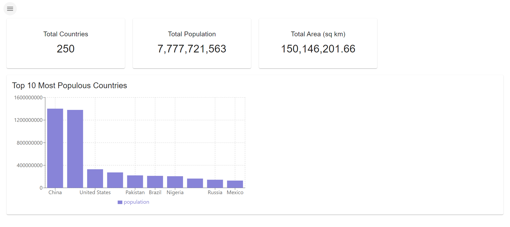
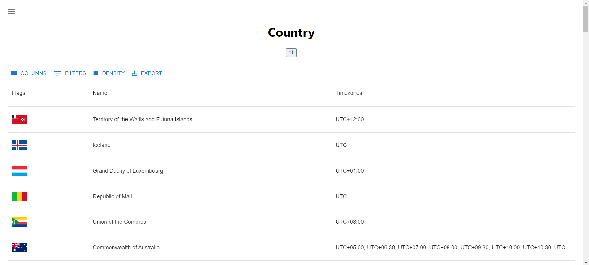

# Country Statistics Dashboard

This project is a web-based dashboard application that displays various statistics about countries, such as population, area, and timezones. The application is built using modern web technologies and provides an intuitive interface for exploring country data.

## Features

- **Total Countries**: Displays the total number of countries.
- **Total Population**: Shows the aggregated population of all countries.
- **Total Area**: Shows the aggregated area of all countries.
- **Country List**: Displays a list of countries with their flags, names, and timezones.
- **Top 10 Most Populous Countries**: A bar chart visualizing the top 10 most populous countries.

## Screenshots

### Total Page



### Country List



## Installation

To run this project locally, follow these steps:

1. **Clone the repository:**

   ```bash
   git clone https://github.com/ahmadharissa/azkatech-assignment.git
   cd azkatech-assignment
   ```

2. **Install dependencies:**

   Ensure you have Node.js and npm installed. Then, run:

   ```bash
   npm install
   ```

3. **Start the development server:**

   ```bash
   npm start
   ```

   The application will be available at `http://localhost:3000`.

## Technologies Used

- **Frontend**: React.js, Chart.js
- **Data**: Data is fetched from a public API.
